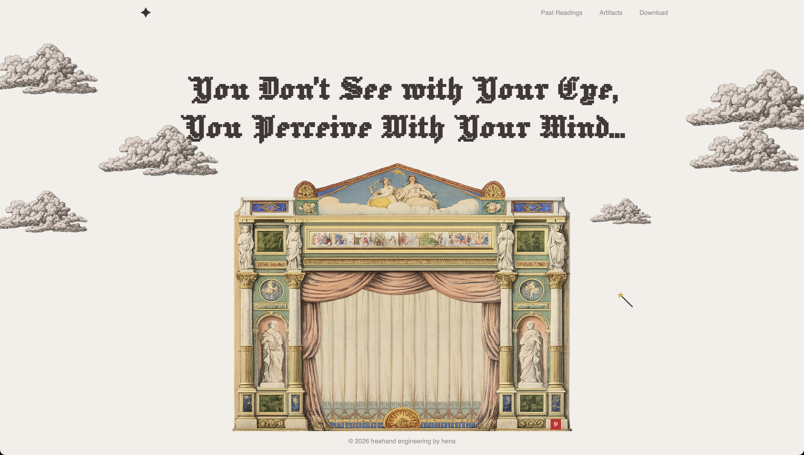

# Velvet Tarot

[Live Demo](https://velvet-tarot-7c4i.onrender.com)

An interactive, AI-powered tarot reading app wrapped in a theatrical, scroll-driven experience. Ask a question, draw your cards, and receive a personalized interpretation powered by Google's Gemini API.

## Preview



The experience opens on a theater entrance. Scroll to raise the curtain, split the powder room doors, and step inside to begin your reading.

Once inside, choose a spread, ask your question, and watch the deck shuffle in hand before your cards fan out and flip to reveal the draw. Gemini reads the spread and returns a written interpretation tailored to your question.

### Spreads

| Spread | Cards | Description |
|--------|-------|-------------|
| Single Card | 1 | Quick, focused insight |
| Past / Present / Future | 3 | Where you've been, where you are, where you're headed |
| Celtic Cross | 10 | The full picture — cross and staff layout |

### Other pages

- **History** — revisit past readings, mark favorites, bulk delete
- **The Arcana** — browse all 78 cards with upright and reversed meanings
- **Download** — self-hosting setup guide

## Getting started

### Prerequisites

- [Node.js](https://nodejs.org/) v18+
- A free [Gemini API key](https://aistudio.google.com/apikey) from Google AI Studio

### Install

```bash
git clone https://github.com/hena-lee/velvet-tarot.git
cd velvet-tarot
npm install
```

### Configure

Create a `.env` file in the project root:

```
GEMINI_API_KEY=your_key_here
```

### Run

```bash
npm start        # start the server
npm run dev      # start with hot-reload (nodemon)
npm test         # run tests
```

Open [http://localhost:3000](http://localhost:3000) in your browser.

## Tech stack

| Layer | Tech |
|-------|------|
| Server | Express v5 |
| AI | Google Gemini 2.0 Flash |
| Frontend | Vanilla JS, HTML, CSS |
| Data | JSON (card definitions + reading history) |
| Tests | Jest |

## API

| Method | Endpoint | Purpose |
|--------|----------|---------|
| `POST` | `/api/shuffle` | Shuffle deck with random orientations |
| `POST` | `/api/interpret` | Generate AI reading for drawn cards |
| `GET` | `/api/cards` | Fetch all 78 card definitions |
| `GET` | `/api/history` | Retrieve past readings |
| `PATCH` | `/api/history/:id/favorite` | Toggle favorite |
| `POST` | `/api/history/delete` | Bulk delete readings |

## Credits

### Card artwork

All 78 tarot card illustrations are from the **Rider-Waite-Smith** deck (1909), originally illustrated by **Pamela Colman Smith** under the direction of **Arthur Edward Waite**. The original artwork is in the public domain. Card images and reference material sourced via [Sacred Texts](https://www.sacred-texts.com/tarot/).

### Fonts

- [Jacquard 12](https://fonts.google.com/specimen/Jacquard+12) — decorative heading font, available on Google Fonts under the [SIL Open Font License](https://openfontlicense.org/)

### Imagery

| Asset | Source |
|-------|--------|
| Theater entrance | Pinterest: https://www.pinterest.com/pin/697072848622016348/ |
| Powder room doors | Pinterest: https://in.pinterest.com/pin/230528074721217011/ |
| Curtain | Pinterest: https://in.pinterest.com/pin/623256035901376670/ |
| Cloud illustrations | Pinterest: https://www.pinterest.com/pin/737323770277729228/ |
| Mosh pit | Animated collage: https://in.pinterest.com/pin/1115696507707853538/ |
| Hand illustrations | Pinterest: https://ar.pinterest.com/pin/708542953917983094/ |
| Wand cursor | Custom SVG |

### Built with

- [Google Generative AI SDK](https://github.com/google/generative-ai-js) — Gemini API client
- [Express](https://expressjs.com/) — web framework
- [Jest](https://jestjs.io/) — testing framework

## License

ISC
