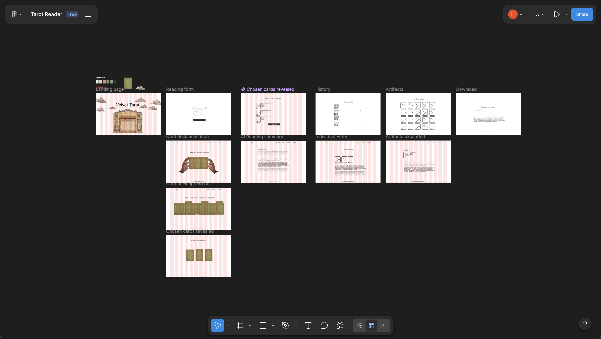

# Velvet Tarot

An interactive tarot reading app with a scroll-driven theatrical entrance, hand-shuffled card animations, and AI-generated interpretations powered by Google's Gemini API.

**[Live Demo](https://velvettarot.vercel.app/)**


Once inside, choose a spread, ask your question, and watch the deck shuffle before your cards fan out and flip to reveal the draw. Gemini reads the spread and returns a written interpretation tailored to your question.

## Technical Highlights

- **Scroll-driven theater entrance** — The landing page uses a wheel event state machine with five discrete phases (idle → storm → curtain rise → door split → theater zoom). Each phase is triggered by scroll input and drives CSS transforms, opacity transitions, SVG ink-bleed filters, and a rain canvas — all coordinated without a single animation library.

- **Card shuffle and fan-out animation** — Cards are stacked and animated in a shuffle loop using `requestAnimationFrame` with randomized lateral drift and easing. Once selection is complete, each card is positioned in a fan arc by computing angle and radius from the center, then transitions to a fixed spread layout with a 3D flip reveal.

- **Celtic Cross positioning** — The 10-card Celtic Cross layout maps each card to its traditional position (significator, crossing card, crown, base, recent past, near future, self, environment, hopes/fears, outcome) using a coordinate system calculated relative to the spread container size, so the layout scales correctly across screen widths.

- **Environment-aware storage** — On first load, the client calls `/api/config` to check whether the server has writable storage. On Vercel (read-only filesystem), all reading history is saved to and retrieved from the browser's IndexedDB with no server involvement. When self-hosted, the same operations go through the REST API and write to a local JSON file. The switch is fully transparent to the user.

- **Gemini as a server-side proxy** — All Gemini API calls are made from the Express server, never the browser, so the API key is never exposed to the client. The server constructs a structured prompt from the drawn cards, their orientations, spread type, and the user's question, then streams the response back.

## Architecture

Velvet Tarot is a vanilla JS frontend served by an Express v5 backend. There is no build step — the server serves the `public/` directory directly as static files alongside the API routes.

The server acts as a proxy to the Gemini API so the API key never reaches the client. Card definitions live in `data/cards.json` and are served via `/api/cards`. On startup, the server exposes `/api/config` to tell the client which storage mode to use: when running on Vercel (read-only filesystem), reading history is stored in the browser via IndexedDB; when self-hosted, it reads and writes to `data/history.json`.

```
Browser (Vanilla JS)
  ├── Scroll-driven entrance (app.js)
  ├── Card draw, shuffle & reveal (reveal.js)
  ├── Reading results & envelope (reading.js)
  └── History, notes & favorites (history-page.js)
        │
        ▼  REST API
  Express Server (server.js)
  ├── /api/config    → storage mode detection
  ├── /api/shuffle   → random card draw + orientations
  ├── /api/interpret → Gemini API proxy (AI reading)
  ├── /api/cards     → card definitions from data/cards.json
  └── /api/history/* → JSON file storage (self-hosted only)
        │
        ▼
  Google Gemini API
```

## Design Process

This project started with wireframes in Figma before any code was written. I mapped out the full user flow, from the theatrical entrance sequence through spread selection, card draw, and reading delivery, to make sure the experience felt intentional at every step.

[](https://www.figma.com/design/J8j9qPkNf6b3JD0C4sC43P/Tarot-Reader?node-id=0-1&t=ZVzktb9BVhH1DAY3-1)

## Tech Stack

| Layer    | Tech                    |
| -------- | ----------------------- |
| Server   | Express v5              |
| AI       | Google Gemini 2.0 Flash |
| Frontend | Vanilla JS, HTML, CSS   |
| Data     | JSON / IndexedDB        |

## API

| Method  | Endpoint                    | Purpose                                            |
| ------- | --------------------------- | -------------------------------------------------- |
| `GET`   | `/api/config`               | Returns storage mode (`serverStorage: true/false`) |
| `POST`  | `/api/shuffle`              | Shuffle deck with random orientations              |
| `POST`  | `/api/interpret`            | Generate AI reading for drawn cards                |
| `GET`   | `/api/cards`                | Fetch all 78 card definitions                      |
| `GET`   | `/api/history`              | Retrieve past readings                             |
| `PATCH` | `/api/history/:id/favorite` | Toggle favorite on a reading                       |
| `PATCH` | `/api/history/:id/notes`    | Update personal notes on a reading                 |
| `POST`  | `/api/history/delete`       | Bulk delete readings                               |

## Getting Started

### Prerequisites

- [Node.js](https://nodejs.org/) v18+
- A free [Gemini API key](https://aistudio.google.com/apikey) from Google AI Studio

### Install

```bash
git clone https://github.com/hena-lee/velvet-tarot.git
cd velvet-tarot
npm install
```

### Configure

Create a `.env` file in the project root:

```
GEMINI_API_KEY=your_key_here
```

### Run

```bash
npm start      # start the server
npm run dev    # start with hot-reload (nodemon)
```

Open [http://localhost:3000](http://localhost:3000) in your browser.

## Data & Privacy

Readings stay private by default. Your question and drawn card names are sent to the Gemini API for interpretation — this is the only external request. No accounts, tracking, or cookies are used. History is stored either server-side (self-hosted) or in your browser's IndexedDB (hosted version), and is never uploaded elsewhere. See the [Gemini API terms](https://ai.google.dev/gemini-api/terms) for Google's data handling policies.

## Credits

### Card Artwork

All 78 tarot card illustrations are from the **Rider-Waite-Smith** deck (1909), originally illustrated by **Pamela Colman Smith** under the direction of **Arthur Edward Waite**. The original artwork is in the public domain. Card images sourced via [Sacred Texts](https://www.sacred-texts.com/tarot/).

### Fonts

All Google Fonts are served under the [SIL Open Font License](https://openfontlicense.org/).

- **California Sun** — display font for the brand name and section headings (local, in `/public/fonts/`)
- [Cormorant Garamond](https://fonts.google.com/specimen/Cormorant+Garamond) — primary serif for reading text and labels
- [Playfair Display](https://fonts.google.com/specimen/Playfair+Display) — serif for card names and arcana headings
- [Spectral](https://fonts.google.com/specimen/Spectral) — base body font
- [Special Elite](https://fonts.google.com/specimen/Special+Elite) — typewriter-style font for form inputs

### Imagery

| Asset                 | Source                                                              |
| --------------------- | ------------------------------------------------------------------- |
| Theater entrance      | Pinterest: https://www.pinterest.com/pin/697072848622016348/        |
| Powder room doors     | Pinterest: https://in.pinterest.com/pin/230528074721217011/         |
| Curtain               | Pinterest: https://in.pinterest.com/pin/623256035901376670/         |
| Cloud illustrations   | Pinterest: https://www.pinterest.com/pin/737323770277729228/        |
| Mosh pit              | Animated collage: https://in.pinterest.com/pin/1115696507707853538/ |
| Tarot card back cover | Pinterest: https://pin.it/231cQtGQQ                                 |

### Built With

- [Google Generative AI SDK](https://github.com/google/generative-ai-js) — Gemini API client
- [Express](https://expressjs.com/) — web framework

## License

ISC
